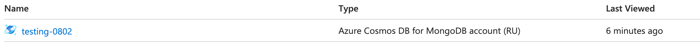
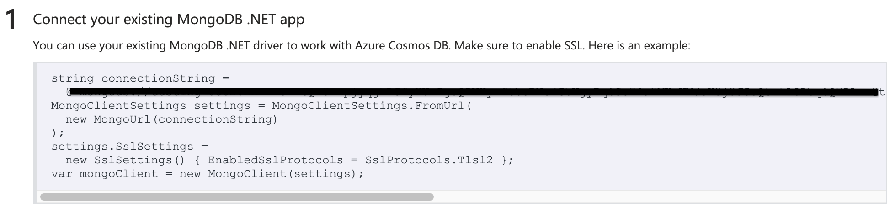

# Application Express Backend Azure MongoDB

A fully functional MongoDB API built with an Express backend and deployed on Azure. This project demonstrates how to integrate MongoDB with an Express application and securely manage your credentials for a scalable cloud-based environment.

Create Mongo DB API in Azure 


Insert credentials in Express backend


---

## Table of Contents

- [Overview](#overview)
- [Features](#features)
- [Setup & Installation](#setup--installation)
- [Usage](#usage)
- [Deployment on Azure](#deployment-on-azure)
- [Screenshots](#screenshots)
- [Contributing](#contributing)
- [License](#license)
- [Contact](#contact)

---

## Overview

This project is designed to help you create a MongoDB API in Azure using an Express backend. It includes clear instructions on setting up your environment, integrating credentials securely, and deploying the solution on Azure. This template is ideal for developers looking to build scalable APIs with a focus on cloud deployment and security.

---

## Features

- **MongoDB Integration:** Seamless connection with MongoDB, enabling CRUD operations.
- **Express Backend:** Robust API routing and middleware using Express.
- **Azure Deployment:** Step-by-step deployment process on Microsoft Azure.
- **Secure Credential Management:** Easy configuration of credentials with environment variables.
- **Scalability:** Built to handle growth with Azure’s automatic scaling tools.

---

## Setup & Installation

### 1. Clone the Repository

Open your terminal and run:

```bash
git clone https://github.com/mhowai0802/Application_expressbackend_azure_mongodb.git


